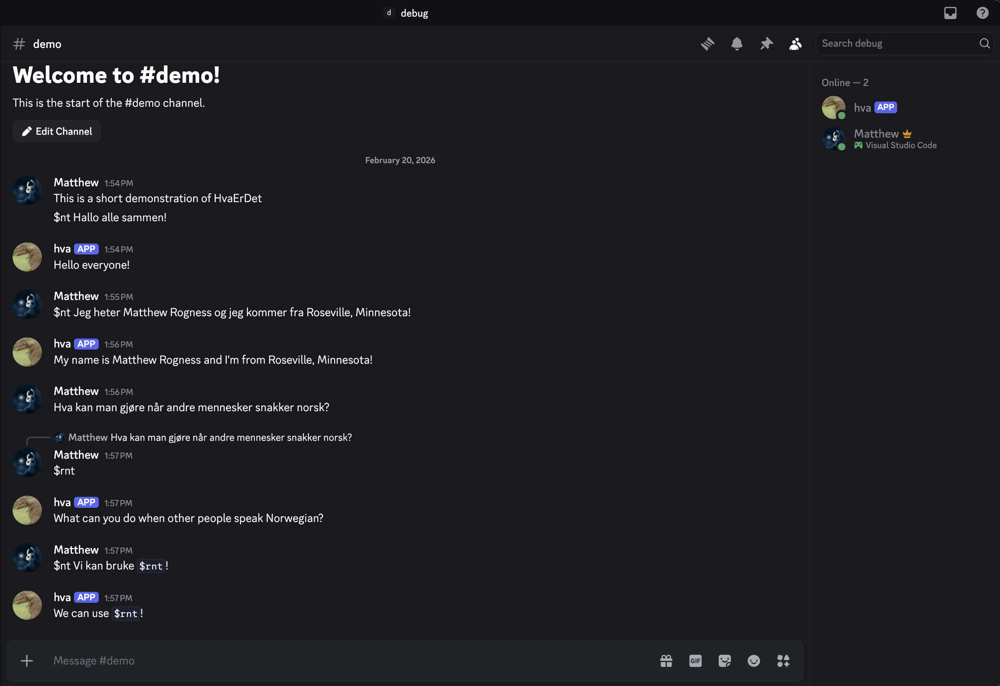

# HvaErDet
Norsk-Engelsk translator for use between friends within a Discord server. Born due to the discrepancy between friends who have taken Norwegian classes and those who haven't.

Keywords:
`$nt` - for inline norwegian translation, for ex. `$nt jeg liker mat` will have the bot respond in the Discord Chanel with `"I like food"`.

`$rnt` - for reply norwegian transaltion, meaning if you reply to a message that's in norwegian with the text `$rnt` the bot will repsond with the translation of that replied-to message.

An example of this being used, here is a demo image.

This repo comes with a setup.py file that can be installed in editable mode via `python3 -m pip install -e .`. After doing this, the whole bot can be run via the command `hvaerdet`.

Note: This repository was made before I took a Web Programming class, and thus represents an limited understanding of how APIs function.
